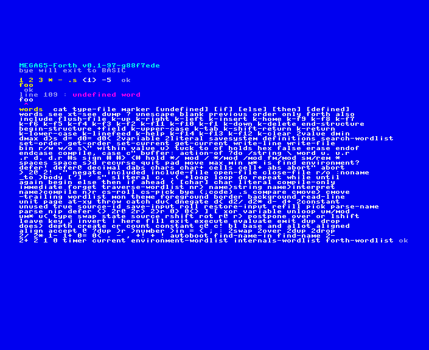

# MEGA65 Forth

An attempt at [Forth](https://forth-standard.org/standard/words) for the [MEGA65](https://mega65.org/).  This is heavily influenced by [FIG FORTH release 1.1](https://github.com/ptorric/figforth)

```
This publication has been made available 
by the Forth Interest Group, 
P. O. box 1105,  San Carlos, CA 94070
```



This is *very* much in the early stages of developement:

- The interpreter is working well enough to support development, but is still pretty minimal.  It needs command line editing features, better error handling, etc.
- There is no file input or support for defining functions yet.  Those are the next priorities so we can start running unit tests, and do most of the remainder of the implementation in Forth.

My apologies if this isn't the greatest Forth implementation.  I don't really have much experience with Forth.  I'm doing this because I've always been intrigued by Forth, and with a new MEGA65 sitting on the dining room table, it seemed the perfect project to learn about Forth, shake decades of dust off my 6502 programming skills, and learn about some of the MEGA65-specific features.

An attempt will be made to:

- Be more ANS FORTH (94) compliant, and hopefully [Forth 2012](http://www.forth200x.org/documents/forth-2012.pdf)
- Provide access to MEGA65 features

# BUILDING

## Requirements

- [Acme](https://sourceforge.net/projects/acme-crossass):  I was using the one from [MEGA65 github](https://github.com/MEGA65/acme) but switched to the svn version to get access to some of the more recent features, but I'm not certain I ended up using them.  It could be that the MEGA65 one will still work.

There is a build script in `bin/build.sh` that can be used.  Right now it doesn't do a huge amount, but eventually I expect
that the build process will get more involved:

- Compiling the builtins
- Use a MEGA65 or xemu to compile the rest of the standard dictionary, possibly for multiple configurations (a minimal set, a complete set, etc)
- Run a test suite
- Run benchmarks
- Building tools (an assembler word set? an editor?)
- Assembling a disk image with various build configuration, source code, examples, tools

## Recommendations

- [Vice](https://vice-emu.sourceforge.io/) for c1541 and petcat to manipulate d81 images
- m65, mega65_ftp from [mega65-tools](https://github.com/MEGA65/mega65-tools)
- [m65dbg](https://github.com/MEGA65/m65dbg)
- [xemu](https://github.com/lgblgblgb/xemu)

# RANDOM TODOs

These should get us to the point of bootstrapping with a dictionary written in forth and running unit tests:
- Basic file reading (just enough to get by for now)
  - [x] OPEN-FILE
  - [x] CLOSE-FILE
  - [x] READ-LINE
  - [x] INCLUDE
  - [x] WRITE-FILE
  - [x] SAVESYSTEM (gforth extension)
  - [ ] Automatic selection of appropriate channel numbers and secondary addresses (first address will be hardcoded as 8 for now)
  - [ ] Automatic selection of disk buffer
  - [ ] Handle file access modes (skip for now?)
  - [ ] REQUIRE (skip for now?)
  - [ ] Fix I/O status handling (when is status from READSS reset?) (skip for now?)
  - [ ] Fix handling of I/O error cases (skip for now?)
  - [ ] Move basepage to top of memory so it's not in the region from $2001 to HERE (ie we don't have to deal with it in SAVESYSTEM and the results will be deterministic)
- [ ] SAVE-INPUT, RESTORE-INPUT, stack of parse inputs
  - [ ] Get SOURCE-ID and SOURCE right during all of this
- [ ] Defining words
- [ ] Bootstrapping with portions of the library written in Forth using the above features
- Tests
  - [ ] [Test suite](https://github.com/gerryjackson/forth2012-test-suite)
- Benchmarks
  - [ ] Compiling the dictionary?
  - [ ] Something without I/O?


There'll be lots more to do after that.

# CREDITS

- Lots of the implementation comes from [FIG FORTH release 1.1](https://github.com/ptorric/figforth)
- [Test suite](https://github.com/gerryjackson/forth2012-test-suite)
